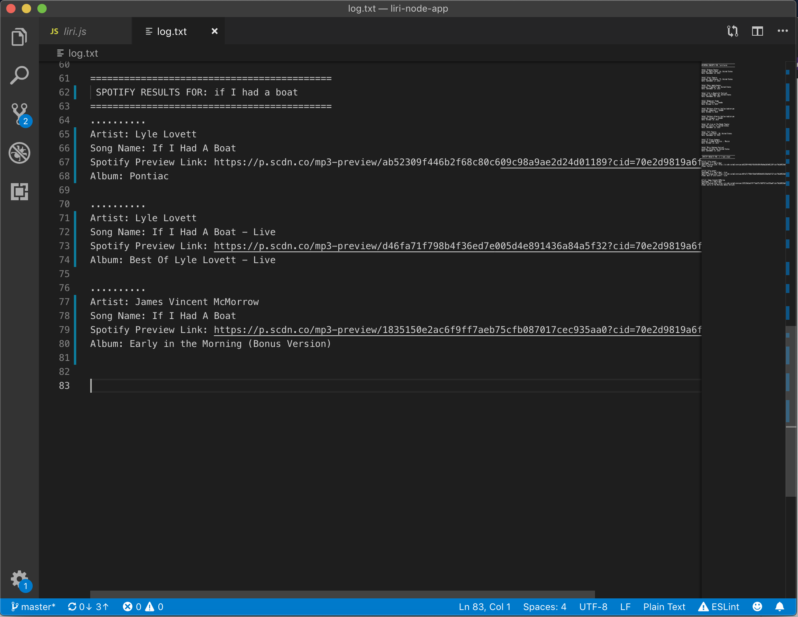
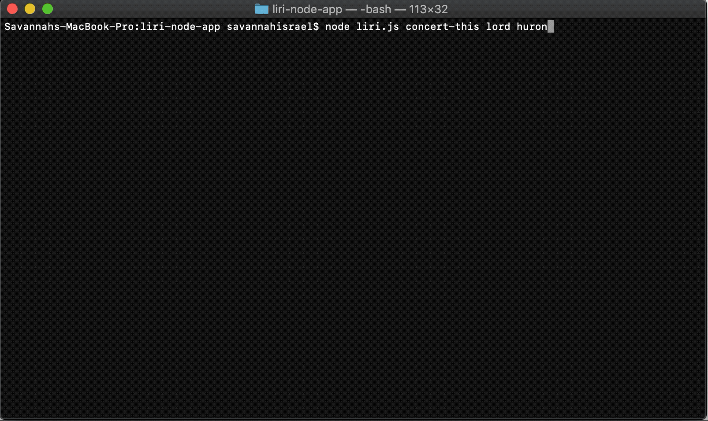
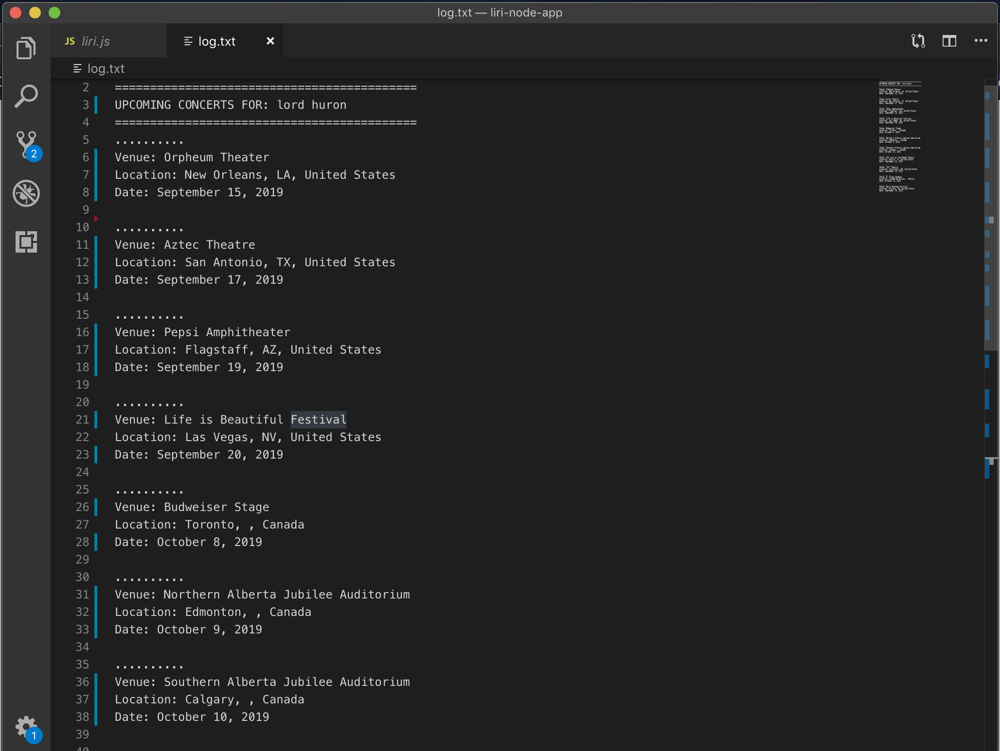
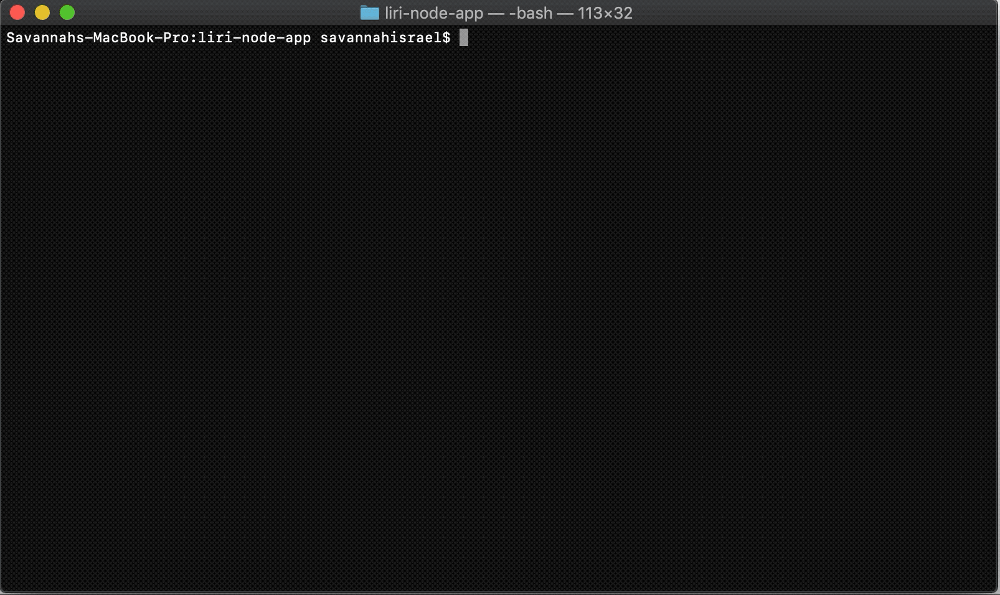

# Liri Node App

Liri is a command line app which takes in two parameters: a command and a search. Liri then completes the commands and returns information back to the user in the terminal/bash and also logs it into a text file to be read.

There are four commands for Liri:  "spotify-this-song", "concert-this", "movie-this", or "do-what-it-says"
The app also records a log.txt file for all commands and results.

## spotify-this-song

When the user enters `node liri.js spotify-this-song (song name)`, Liri uses the song name to search on the Spotify API. Information about the first five songs are returned. This info includes the song name, album title, artists, and a link to the song preview on Spotify. This is also appended to the log.txt file.

## concert-this

 

When the user enters `node liri.js concert-this (band name)`, Liri uses the band name to search on the Bands In Town API. It will then return the venue, location, and date of upcoming concerts. This is also appended to the log.txt file.

## movie-this

When the user enters `node liri.js movie-this (movie title)`, Liri uses movie title to search on the OMDB API. Information about the movie, including the title, year produced, location, actors, ratings, and plot are returned. This information is also appended to the log.txt file.

## do-what-it-says

When the user enters `node liri.js do-what-it-says`, Liri reads a text file and executes what is contained in there. Currently, the random.txt file contains:
> concert-this,"Maggie Rogers"

This text file can be changed to different commands and inputs and Liri will execute it accordingly.

### Technologies

Node.js, JavaScript, OMDB API, Bands In Town API, Spotify API, Axios Node Module, and Moment Node Module.

#### Created by Savannah Israel
